# Comprehensive Report on Generative AI and Large Language Models (LLMs)

**A Technical Overview of Architectures, Applications, and Impact**

---

## Executive Summary

This comprehensive report explores the fundamental concepts, architectures, applications, and scaling impacts of Generative Artificial Intelligence (AI) and Large Language Models (LLMs). As transformative technologies reshaping industries worldwide, Generative AI systems have demonstrated unprecedented capabilities in content creation, natural language understanding, and problem-solving.

The report is structured to provide both technical depth and practical insights, covering foundational AI concepts, advanced neural network architectures (particularly Transformers), real-world applications across industries, and the profound effects of model scaling on performance and capabilities. Whether you are a researcher, practitioner, student, or business leader, this document serves as an authoritative reference for understanding the current state and future trajectory of Generative AI.

---

## Table of Contents

1. [Introduction to AI and Machine Learning](#1-introduction-to-ai-and-machine-learning)
2. [Foundational Concepts of Generative AI](#2-foundational-concepts-of-generative-ai)
3. [Generative AI Architectures: Focus on Transformers](#3-generative-ai-architectures-focus-on-transformers)
4. [Training Process and Data Requirements](#4-training-process-and-data-requirements)
5. [Applications of Generative AI](#5-applications-of-generative-ai)
6. [Impact of Scaling in Large Language Models](#6-impact-of-scaling-in-large-language-models)
7. [Limitations and Ethical Considerations](#7-limitations-and-ethical-considerations)
8. [Future Trends and Research Directions](#8-future-trends-and-research-directions)
9. [Conclusion](#9-conclusion)
10. [References](#10-references)

---

## 1. Introduction to AI and Machine Learning

### 1.1 Overview of Artificial Intelligence

Artificial Intelligence (AI) refers to the capability of machines to perform tasks that typically require human intelligence. These tasks include learning from experience, understanding natural language, recognizing patterns, solving problems, and making decisions. AI can be broadly categorized into:

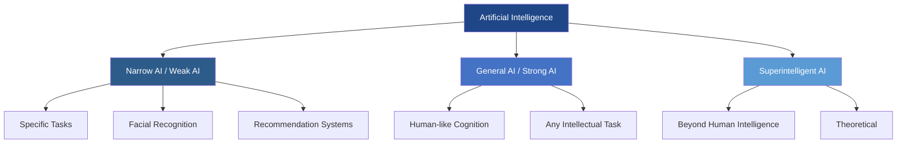

- **Narrow AI (Weak AI):** Systems designed to perform specific tasks, such as facial recognition, spam filtering, or recommendation systems.
- **General AI (Strong AI):** Hypothetical systems with human-like cognitive abilities capable of performing any intellectual task.
- **Superintelligent AI:** AI that surpasses human intelligence across all domains—currently theoretical.

### 1.2 Machine Learning Fundamentals

Machine Learning (ML) is a subset of AI that enables systems to learn and improve from experience without being explicitly programmed. ML algorithms identify patterns in data and make predictions or decisions based on those patterns.

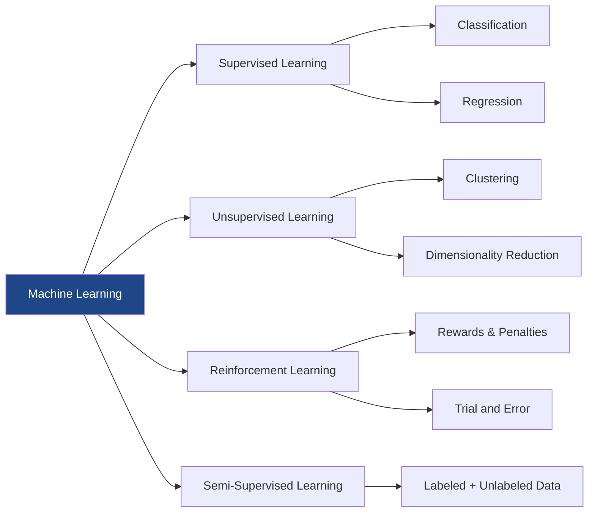

**Key Machine Learning Paradigms:**

- **Supervised Learning:** Learning from labeled data to make predictions (e.g., classification, regression).
- **Unsupervised Learning:** Discovering hidden patterns in unlabeled data (e.g., clustering, dimensionality reduction).
- **Reinforcement Learning:** Learning through trial and error using rewards and penalties.
- **Semi-Supervised and Self-Supervised Learning:** Hybrid approaches that leverage both labeled and unlabeled data.

### 1.3 Deep Learning and Neural Networks

Deep Learning is a specialized branch of machine learning that uses artificial neural networks with multiple layers (hence "deep") to model complex patterns in data. Inspired by the structure of the human brain, neural networks consist of interconnected nodes (neurons) organized in layers: input layer, hidden layers, and output layer.


**Key characteristics of deep learning include:**

- Automatic feature extraction from raw data
- Ability to handle high-dimensional data (images, text, audio)
- Scalability with increasing data and computational resources
- Applications in computer vision, natural language processing, speech recognition, and more

---

## 2. Foundational Concepts of Generative AI

### 2.1 Definition and Core Principles

Generative AI refers to artificial intelligence systems capable of creating new, original content—including text, images, music, code, and video—based on patterns learned from training data. Unlike discriminative models that classify or predict existing data, generative models learn the underlying probability distribution of the data and can sample from it to generate novel outputs.

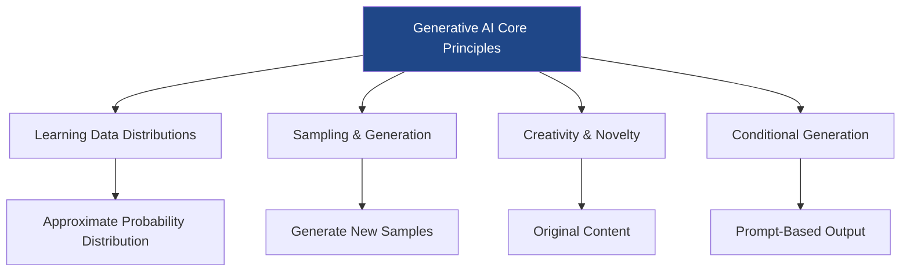

**Core principles of Generative AI:**

- **Learning Data Distributions:** Models learn to approximate the probability distribution of training data.
- **Sampling and Generation:** Once trained, models can generate new samples that resemble the training data.
- **Creativity and Novelty:** Outputs are original rather than copied, though influenced by training patterns.
- **Conditional Generation:** Advanced models can generate content based on specific prompts or conditions.

### 2.2 Types of Generative AI Models

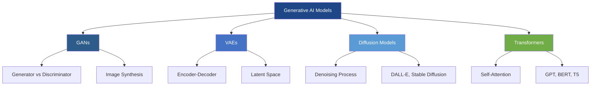

#### 2.2.1 Generative Adversarial Networks (GANs)

GANs, introduced by Ian Goodfellow in 2014, consist of two neural networks—a generator and a discriminator—that compete in a zero-sum game. The generator creates synthetic data, while the discriminator evaluates whether data is real or fake. Through this adversarial process, the generator improves its ability to create realistic outputs.

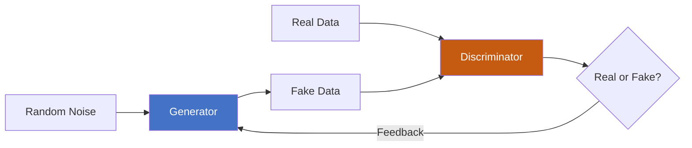

**Applications:**
- Image synthesis and super-resolution
- Style transfer and artistic image generation
- Data augmentation for training other models

#### 2.2.2 Variational Autoencoders (VAEs)

VAEs are probabilistic generative models that learn to encode input data into a lower-dimensional latent space and then decode it back to the original space. By imposing constraints on the latent space distribution, VAEs can generate new samples by sampling from this learned distribution.

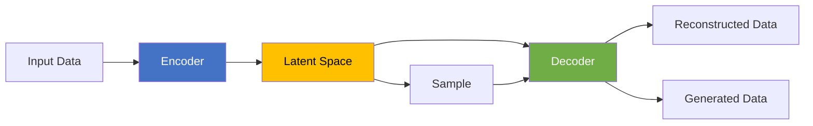

**Applications:**
- Image generation and reconstruction
- Anomaly detection
- Data compression and denoising

#### 2.2.3 Diffusion Models

Diffusion models generate data by learning to reverse a gradual noising process. Starting from pure noise, the model iteratively denoises the data to produce high-quality samples. Recent advances have made diffusion models state-of-the-art for image generation, competing with and often surpassing GANs.


**Notable implementations:**
- DALL-E 2, Stable Diffusion, Midjourney (image generation)
- Text-to-image synthesis with remarkable fidelity

#### 2.2.4 Transformer-Based Generative Models

Transformers, originally designed for natural language processing, have become the foundation for modern Large Language Models (LLMs). These models use self-attention mechanisms to process sequential data and generate coherent, contextually relevant text. Transformer-based models have revolutionized NLP and extended to multimodal applications.

**Examples:**
- GPT family (GPT-3, GPT-4): Text generation, conversation, code
- BERT and its variants: Understanding and generating contextual text
- T5, BART: Sequence-to-sequence tasks

---

## 3. Generative AI Architectures: Focus on Transformers

### 3.1 The Transformer Architecture

The Transformer architecture, introduced in the seminal paper "Attention Is All You Need" (Vaswani et al., 2017), revolutionized sequence modeling by replacing recurrent layers with self-attention mechanisms. This innovation enabled parallel processing of sequences, dramatically improving training efficiency and model scalability.

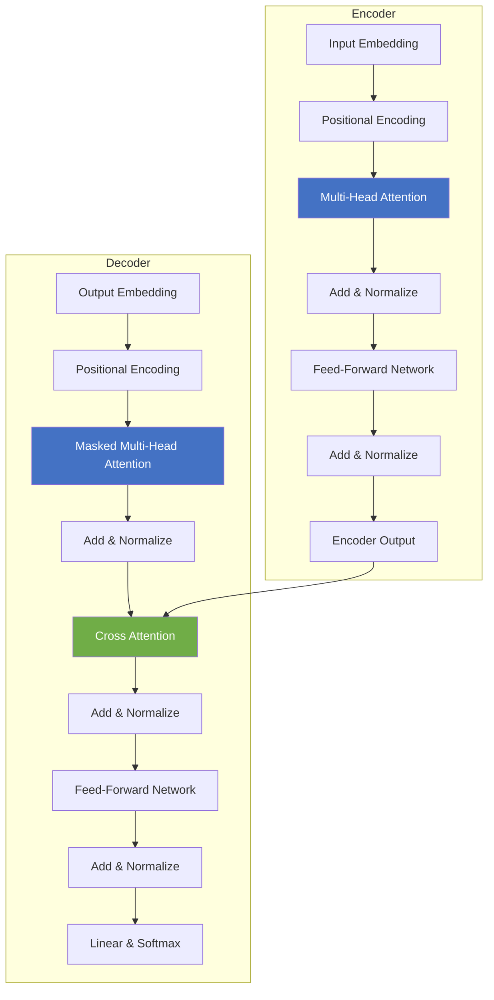

#### 3.1.1 Key Components of Transformers

- **Self-Attention Mechanism:** Computes relationships between all tokens in a sequence simultaneously, allowing the model to capture long-range dependencies.
- **Multi-Head Attention:** Uses multiple attention heads to capture different aspects of token relationships, enriching representation learning.
- **Positional Encoding:** Injects position information into input embeddings since self-attention is permutation-invariant.
- **Feed-Forward Networks:** Applied independently to each position, adding non-linearity and capacity.
- **Layer Normalization and Residual Connections:** Stabilize training and enable deep architectures.
- **Encoder-Decoder Structure:** Original architecture uses both encoder (for input processing) and decoder (for output generation).

#### 3.1.2 Mathematical Foundation

The self-attention mechanism is defined as:

**Attention(Q, K, V) = softmax(QK^T / √d_k) V**

where Q (queries), K (keys), and V (values) are learned linear projections of the input, and d_k is the dimension of the key vectors. This formulation allows the model to weigh the importance of different tokens when processing each position.

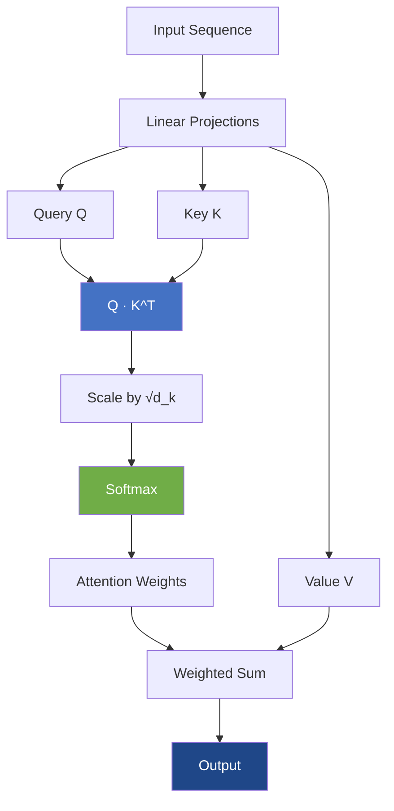

### 3.2 Evolution of Transformer-Based LLMs

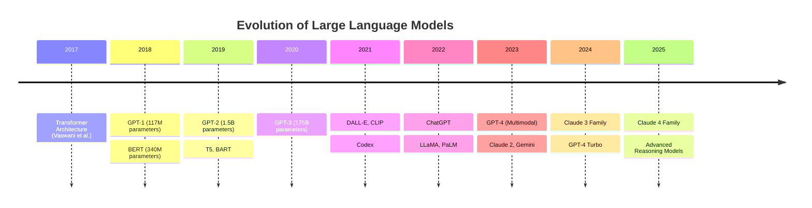

#### 3.2.1 GPT (Generative Pre-trained Transformer)

The GPT series, developed by OpenAI, uses a decoder-only transformer architecture trained on next-token prediction. This autoregressive approach enables the model to generate coherent text by predicting one token at a time based on preceding context.

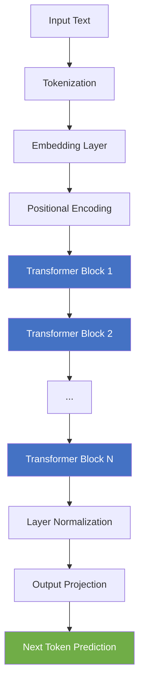

**Evolution:**

- **GPT-1 (2018):** 117M parameters, demonstrated transfer learning from unsupervised pre-training
- **GPT-2 (2019):** 1.5B parameters, showed impressive zero-shot task performance
- **GPT-3 (2020):** 175B parameters, few-shot learning via in-context prompting
- **GPT-4 (2023):** Multimodal capabilities, enhanced reasoning and reliability

#### 3.2.2 BERT (Bidirectional Encoder Representations from Transformers)

BERT, introduced by Google, uses an encoder-only architecture trained with masked language modeling (predicting masked tokens) and next sentence prediction. Unlike GPT's left-to-right approach, BERT processes text bidirectionally, making it excellent for understanding tasks.

```mermaid
flowchart TD
    A[Input: The cat [MASK] on the mat] --> B[Tokenization]
    B --> C[Token Embeddings]
    C --> D[Segment Embeddings]
    D --> E[Position Embeddings]
    E --> F[Transformer Encoder Layers]
    F --> G[Output Representations]
    G --> H[Predict: sat]
    
    style F fill:#4472c4,color:#fff
    style H fill:#70ad47,color:#fff
```

**Applications:**
- Question answering and information retrieval
- Sentiment analysis and text classification
- Named entity recognition and language understanding

#### 3.2.3 Other Notable Architectures

- **T5 (Text-to-Text Transfer Transformer):** Frames all NLP tasks as text-to-text problems
- **BART:** Combines bidirectional encoder with autoregressive decoder for sequence-to-sequence tasks
- **Claude (Anthropic):** Constitutional AI with focus on helpfulness, harmlessness, and honesty
- **LLaMA, Mistral, Gemini:** Advanced open and proprietary models with improved efficiency

---

## 4. Training Process and Data Requirements

### 4.1 Pre-training Phase

Pre-training is the initial phase where models learn general language understanding from massive text corpora. This unsupervised learning phase involves predicting missing or next tokens across billions of documents, enabling models to capture grammar, facts, reasoning patterns, and world knowledge.

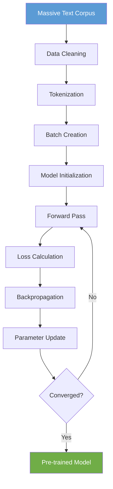

**Key aspects:**

- **Data Scale:** Models are trained on datasets containing hundreds of billions to trillions of tokens from diverse sources including books, websites, code repositories, and scientific papers.
- **Computational Requirements:** Training large models requires thousands of GPUs/TPUs running for weeks or months, costing millions of dollars.
- **Objective Functions:** Next-token prediction (GPT), masked language modeling (BERT), or hybrid approaches.

### 4.2 Fine-tuning and Alignment

After pre-training, models undergo fine-tuning to specialize for specific tasks or align with human values and preferences.

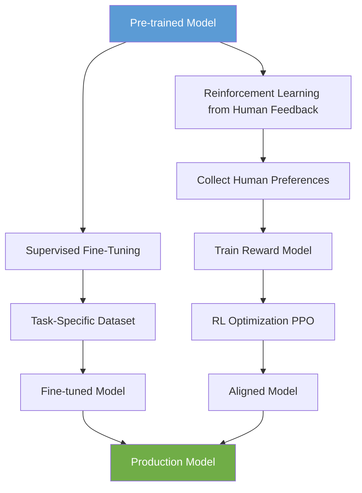

#### 4.2.1 Supervised Fine-Tuning (SFT)

Models are trained on high-quality, task-specific datasets with human-annotated examples. This teaches the model desired behaviors, output formats, and task-specific knowledge.

#### 4.2.2 Reinforcement Learning from Human Feedback (RLHF)

RLHF optimizes models based on human preferences rather than traditional loss functions. The process involves:

1. Collecting human preference data on model outputs
2. Training a reward model to predict human preferences
3. Using reinforcement learning (typically PPO) to optimize the language model based on the reward model

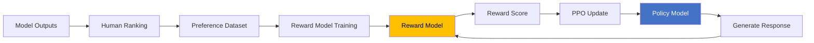

### 4.3 Data Quality and Curation

The quality of training data significantly impacts model performance. Modern approaches employ sophisticated data curation strategies:

- Filtering and deduplication to remove low-quality or redundant content
- Balancing data sources to prevent biases and ensure diverse knowledge
- Removing toxic, biased, or copyrighted content
- Incorporating specialized high-quality datasets (academic papers, code, books)

---

## 5. Applications of Generative AI

### 5.1 Natural Language Processing Applications

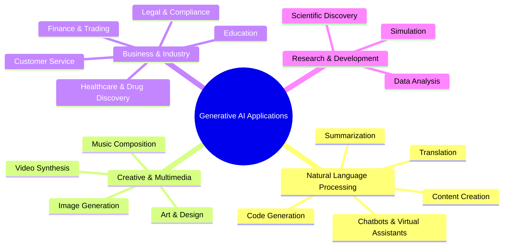

#### 5.1.1 Conversational AI and Chatbots

LLMs power sophisticated chatbots capable of engaging in natural, contextual conversations. These systems serve as customer support agents, personal assistants, educational tutors, and mental health companions, providing human-like interactions at scale.

#### 5.1.2 Content Creation and Writing Assistance

Generative AI assists writers, marketers, and content creators by generating articles, marketing copy, social media posts, email drafts, and creative fiction. These tools enhance productivity while maintaining human oversight for quality and authenticity.

#### 5.1.3 Translation and Multilingual Communication

Modern LLMs provide high-quality translation across dozens of languages, breaking down language barriers in global communication, business, and education.

#### 5.1.4 Code Generation and Software Development

AI coding assistants like GitHub Copilot, based on models like Codex, help developers write code faster by suggesting completions, generating functions from natural language descriptions, and debugging errors. These tools democratize programming and accelerate software development.

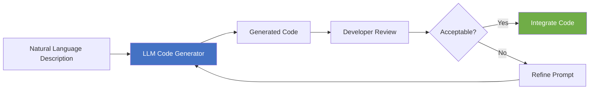

### 5.2 Creative and Multimedia Applications

#### 5.2.1 Image Generation and Editing

Text-to-image models like DALL-E, Midjourney, and Stable Diffusion create photorealistic images, artwork, and designs from text prompts. Applications include advertising, game design, architectural visualization, and digital art.

#### 5.2.2 Music and Audio Generation

AI models generate music compositions, sound effects, and synthetic voices. Applications range from background music for videos to accessibility tools for speech synthesis and audio restoration.

#### 5.2.3 Video Generation and Editing

Emerging video generation models create short video clips from text descriptions, enable automated video editing, and synthesize realistic deepfakes for entertainment and special effects (with ethical considerations).

### 5.3 Business and Industry Applications

#### 5.3.1 Healthcare and Drug Discovery

Generative AI assists in protein structure prediction, drug candidate generation, medical report summarization, and diagnostic support. Models like AlphaFold have revolutionized structural biology by accurately predicting protein folding.

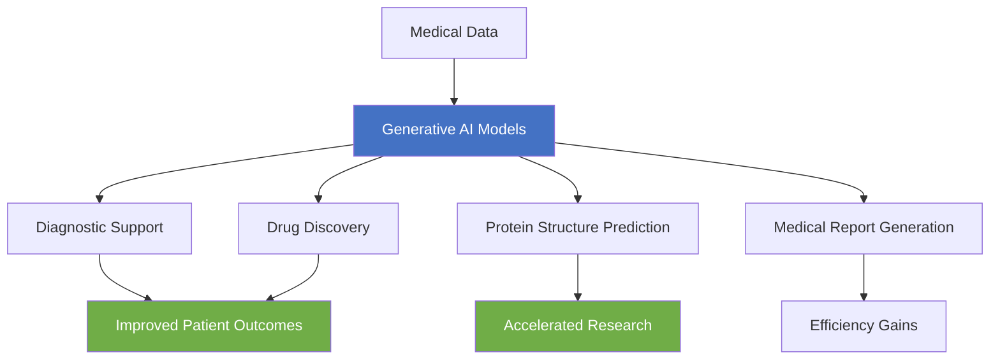

#### 5.3.2 Finance and Risk Management

Financial institutions use generative AI for fraud detection, market analysis, automated report generation, customer service, and risk modeling. LLMs analyze vast financial documents to extract insights and support decision-making.

#### 5.3.3 Education and Personalized Learning

AI tutors provide personalized learning experiences, answer student questions, generate practice problems, and offer feedback. These tools scale individual attention and adapt to each learner's pace and style.

#### 5.3.4 Legal and Compliance

Legal AI assists with contract analysis, document review, case law research, and compliance monitoring, significantly reducing time spent on routine legal tasks.

---

## 6. Impact of Scaling in Large Language Models

### 6.1 Scaling Laws and Emergent Capabilities

Research has revealed predictable relationships between model scale (parameters, data, compute) and performance, known as scaling laws. As models grow larger, they exhibit improved performance on benchmarks, but more remarkably, they demonstrate emergent capabilities—abilities not explicitly present in smaller models.

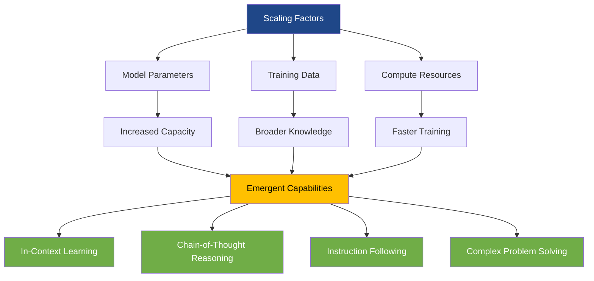

**Examples of emergent capabilities:**

- **In-context learning:** Ability to perform tasks from examples in the prompt without fine-tuning
- **Chain-of-thought reasoning:** Breaking down complex problems into logical steps
- **Instruction following:** Understanding and executing nuanced instructions
- **Arithmetic and symbolic reasoning:** Solving mathematical and logical problems

### 6.2 The Role of Parameters, Data, and Compute

```mermaid
flowchart TD
    subgraph Scaling Components
        A[Model Parameters]
        B[Training Data Volume]
        C[Computational Resources]
    end
    
    A --> D[Model Capacity]
    B --> E[Knowledge Breadth]
    C --> F[Training Efficiency]
    
    D --> G[Performance Improvement]
    E --> G
    F --> G
    
    G --> H[Better Reasoning]
    G --> I[Factual Accuracy]
    G --> J[Task Versatility]
    
    style G fill:#ffc000,color:#000
```

#### 6.2.1 Model Parameters

Parameters are the learnable weights in a neural network. Larger models with more parameters can capture more complex patterns and store more knowledge. The progression from GPT-2 (1.5B parameters) to GPT-3 (175B) to GPT-4 demonstrates continuous improvement in reasoning, factual accuracy, and task versatility.

**Parameter Growth Timeline:**

| Model | Year | Parameters | Key Improvement |
|-------|------|------------|-----------------|
| GPT-1 | 2018 | 117M | Transfer learning |
| GPT-2 | 2019 | 1.5B | Zero-shot performance |
| GPT-3 | 2020 | 175B | Few-shot learning |
| GPT-4 | 2023 | Unknown | Multimodal, reasoning |
| Claude 3 Opus | 2024 | Unknown | Enhanced capabilities |

#### 6.2.2 Training Data Volume

Model performance scales with the amount of high-quality training data. Modern LLMs are trained on datasets containing hundreds of billions to over a trillion tokens, encompassing diverse text from the internet, books, code, and specialized domains.

#### 6.2.3 Computational Resources

Training the largest models requires massive computational infrastructure. For example, training GPT-3 consumed approximately 3.14 × 10²³ FLOPS (floating-point operations), taking thousands of GPU-days. The trend toward larger models drives innovations in distributed training, hardware acceleration, and algorithmic efficiency.

### 6.3 Efficiency and Alternative Scaling Approaches

While larger models show impressive capabilities, the computational cost and environmental impact have prompted research into more efficient approaches:

```mermaid
flowchart TD
    A[Efficiency Techniques] --> B[Model Compression]
    A --> C[Mixture of Experts]
    A --> D[Sparse Attention]
    A --> E[Data Quality Optimization]
    
    B --> F[Quantization]
    B --> G[Pruning]
    B --> H[Knowledge Distillation]
    
    C --> I[Conditional Computation]
    D --> J[Reduced Complexity]
    E --> K[Better Performance per Token]
    
    F --> L[Smaller Deployable Models]
    G --> L
    H --> L
    I --> L
    J --> L
    K --> L
    
    style A fill:#1f4788,color:#fff
    style L fill:#70ad47,color:#fff
```

- **Model Compression:** Techniques like quantization, pruning, and knowledge distillation reduce model size while preserving performance.
- **Mixture of Experts (MoE):** Activating only relevant subnetworks for each input, improving efficiency without sacrificing capacity.
- **Sparse Attention:** Reducing computational complexity of attention mechanisms for longer sequences.
- **Better Data Quality:** Focusing on curating higher-quality training data rather than simply scaling volume.

### 6.4 Performance Benchmarks and Evaluation

Evaluating LLM capabilities requires comprehensive benchmarks across diverse tasks:

- **GLUE and SuperGLUE:** Natural language understanding tasks
- **MMLU (Massive Multitask Language Understanding):** Knowledge across 57 subjects
- **HumanEval:** Code generation capability
- **TruthfulQA:** Factual accuracy and resistance to misinformation
- **BIG-Bench:** Diverse challenging tasks testing reasoning and knowledge

---

## 7. Limitations and Ethical Considerations

### 7.1 Technical Limitations

```mermaid
mindmap
  root((LLM Limitations))
    Technical
      Hallucinations
      Context Window Limits
      Reasoning Gaps
      Knowledge Cutoff
      Computational Cost
    Ethical
      Bias & Fairness
      Misinformation
      Privacy Concerns
      Job Displacement
    Safety
      Alignment Challenges
      Adversarial Attacks
      Misuse Potential
```

- **Hallucinations:** Models can generate plausible-sounding but factually incorrect information with confidence.
- **Context Window Limitations:** While expanding, models still have finite context limits restricting long-document processing.
- **Reasoning Limitations:** Despite improvements, models struggle with complex multi-step reasoning and logical consistency.
- **Knowledge Cutoff:** Training data has temporal boundaries, making models unaware of recent events.
- **Computational Costs:** Training and running large models require significant energy and financial resources.

### 7.2 Ethical and Societal Concerns

#### 7.2.1 Bias and Fairness

LLMs can perpetuate and amplify biases present in training data, leading to unfair or discriminatory outputs regarding gender, race, religion, and other protected characteristics. Addressing bias requires careful data curation, evaluation, and mitigation strategies.

```mermaid
flowchart TD
    A[Training Data] --> B[Biased Patterns]
    B --> C[Model Learning]
    C --> D[Biased Outputs]
    
    E[Mitigation Strategies] --> F[Data Curation]
    E --> G[Bias Detection]
    E --> H[Adversarial Testing]
    E --> I[Fine-tuning]
    
    F --> J[Fairer Models]
    G --> J
    H --> J
    I --> J
    
    style D fill:#c55a11,color:#fff
    style J fill:#70ad47,color:#fff
```

#### 7.2.2 Misinformation and Deepfakes

The ability to generate convincing text, images, and videos raises concerns about misinformation, propaganda, and identity fraud. Safeguards, watermarking, and detection tools are critical to mitigate misuse.

#### 7.2.3 Privacy and Data Security

Training on web-scraped data raises privacy issues when personal information is included. Models may inadvertently memorize and leak sensitive data. Techniques like differential privacy and careful data filtering help protect privacy.

#### 7.2.4 Job Displacement and Economic Impact

Automation of tasks traditionally performed by humans (writing, coding, customer service) may displace workers. While AI creates new opportunities, society must address workforce transitions and ensure equitable access to AI benefits.

#### 7.2.5 Intellectual Property and Copyright

Questions around training data rights, ownership of AI-generated content, and potential copyright infringement remain legally and ethically complex.

### 7.3 Safety and Alignment

Ensuring AI systems behave safely and align with human values is paramount. Research focuses on:

- Robust alignment techniques (RLHF, Constitutional AI)
- Red-teaming and adversarial testing
- Transparency and explainability
- Regulatory frameworks and governance

---

## 8. Future Trends and Research Directions

### 8.1 Multimodal AI

Future models will seamlessly integrate text, images, audio, and video understanding and generation. Models like GPT-4V, Gemini, and others already demonstrate impressive multimodal capabilities, enabling richer human-AI interaction and new applications.

```mermaid
graph TD
    A[Multimodal AI] --> B[Text]
    A --> C[Images]
    A --> D[Audio]
    A --> E[Video]
    A --> F[3D/Spatial]
    
    B --> G[Unified Understanding]
    C --> G
    D --> G
    E --> G
    F --> G
    
    G --> H[Rich Applications]
    H --> I[Virtual Assistants]
    H --> J[Content Creation]
    H --> K[AR/VR Experiences]
    
    style A fill:#1f4788,color:#fff
    style G fill:#ffc000,color:#000
```

### 8.2 Agent-Based AI Systems

AI agents that can plan, use tools, interact with environments, and complete complex multi-step tasks autonomously represent the next frontier. These systems will transform how we work, automating workflows and enabling new forms of human-AI collaboration.

```mermaid
flowchart TD
    A[AI Agent] --> B[Task Understanding]
    B --> C[Planning]
    C --> D[Tool Selection]
    D --> E[Action Execution]
    E --> F[Environment Interaction]
    F --> G[Feedback Collection]
    G --> H{Goal Achieved?}
    H -->|No| C
    H -->|Yes| I[Task Complete]
    
    style A fill:#4472c4,color:#fff
    style I fill:#70ad47,color:#fff
```

### 8.3 Improved Reasoning and Reliability

Research continues to enhance models' logical reasoning, mathematical capabilities, and factual accuracy. Techniques like chain-of-thought prompting, tree-of-thought reasoning, and integration with external knowledge bases and search tools promise more reliable AI systems.

### 8.4 Personalization and Customization

Future AI systems will adapt to individual users' preferences, communication styles, and needs through continual learning and memory mechanisms, providing increasingly personalized experiences while respecting privacy.

### 8.5 Democratization and Accessibility

Efforts to make AI more accessible include developing smaller, more efficient models; lowering computational barriers; creating user-friendly interfaces; and expanding multilingual capabilities. Open-source initiatives and cloud-based services will further democratize AI access.

### 8.6 Sustainable and Efficient AI

As environmental concerns grow, research focuses on reducing the carbon footprint of AI training and inference through algorithmic innovations, specialized hardware, and renewable energy. Efficiency improvements will make powerful AI more sustainable and widely deployable.

```mermaid
flowchart LR
    A[Future AI Trends] --> B[Sustainability]
    A --> C[Efficiency]
    A --> D[Accessibility]
    
    B --> E[Green Computing]
    C --> F[Better Algorithms]
    D --> G[Open Source]
    
    E --> H[Wider Adoption]
    F --> H
    G --> H
    
    style A fill:#1f4788,color:#fff
    style H fill:#70ad47,color:#fff
```

---

## 9. Conclusion

Generative AI and Large Language Models represent a paradigm shift in artificial intelligence, demonstrating capabilities once thought to be decades away. From the foundational Transformer architecture to massive models with hundreds of billions of parameters, these systems have shown remarkable progress in understanding and generating human language, code, images, and more.

The scaling laws governing LLM development have revealed predictable improvements with increased model size, data, and compute, alongside emergent capabilities that transcend simple performance gains. Applications span virtually every industry—from healthcare and finance to education and creative arts—demonstrating both the versatility and impact of these technologies.

However, significant challenges remain. Technical limitations like hallucinations and reasoning gaps, alongside critical ethical concerns around bias, privacy, safety, and societal impact, require ongoing research, thoughtful governance, and responsible deployment practices. The future of AI depends not only on advancing capabilities but also on ensuring these powerful tools benefit humanity equitably and safely.

Looking forward, the trajectory points toward increasingly capable, multimodal, and agentic AI systems that integrate more seamlessly into human workflows and decision-making. As the field evolves, interdisciplinary collaboration among researchers, policymakers, ethicists, and practitioners will be essential to navigate the opportunities and challenges ahead.

Generative AI is not merely a technological innovation—it is a transformative force reshaping how we create, communicate, work, and learn. Understanding its fundamentals, architectures, applications, and implications is crucial for anyone seeking to engage with the defining technology of our era.

---

## 10. References

This report synthesizes information from multiple authoritative sources in AI research and development. Key references include:

1. **Vaswani, A., et al. (2017).** *"Attention Is All You Need."* Advances in Neural Information Processing Systems.

2. **Brown, T., et al. (2020).** *"Language Models are Few-Shot Learners."* Advances in Neural Information Processing Systems.

3. **Devlin, J., et al. (2019).** *"BERT: Pre-training of Deep Bidirectional Transformers for Language Understanding."* NAACL-HLT.

4. **Goodfellow, I., et al. (2014).** *"Generative Adversarial Networks."* Advances in Neural Information Processing Systems.

5. **Kaplan, J., et al. (2020).** *"Scaling Laws for Neural Language Models."* arXiv preprint.

6. **OpenAI (2023).** *"GPT-4 Technical Report."* OpenAI Research.

7. **Anthropic (2024).** *"Claude Model Documentation."* Anthropic Technical Documentation.

8. **Bommasani, R., et al. (2021).** *"On the Opportunities and Risks of Foundation Models."* arXiv preprint.

9. **Ouyang, L., et al. (2022).** *"Training language models to follow instructions with human feedback."* Advances in Neural Information Processing Systems.

10. **Ramesh, A., et al. (2022).** *"Hierarchical Text-Conditional Image Generation with CLIP Latents."* arXiv preprint.

### Additional Resources:

- **OpenAI Research** - https://openai.com/research
- **Anthropic AI Safety Research** - https://www.anthropic.com/research
- **Google AI Research** - https://ai.google/research
- **Meta AI Research** - https://ai.meta.com/research
- **arXiv.org** - Machine Learning section
- **Papers With Code** - https://paperswithcode.com

---
